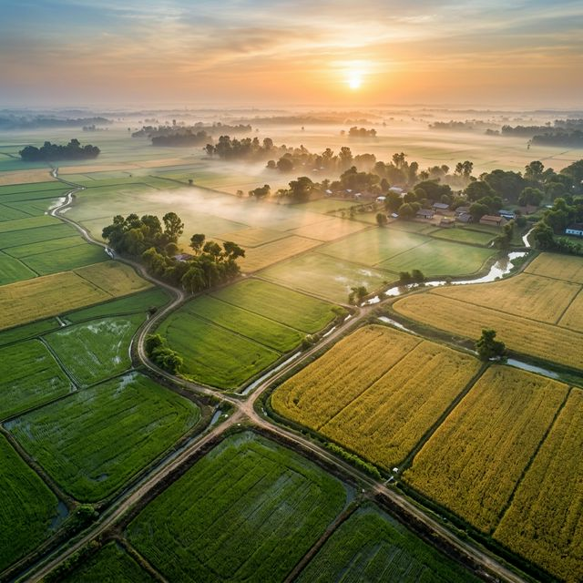

<p align="center">
  
</p>

<h1 align="center">🌾 Agriva</h1>
<p align="center"><strong>The AI copilot that helps Indian farmers sell smarter, grow better, and worry less.</strong></p>

<p align="center">
  
  
  
  
</p>

---

## The Problem

Every year, millions of Indian farmers lose money — not because their crops failed, but because they sold on the wrong day.

A farmer in Vidarbha harvests 20 quintals of cotton. He takes it to the Mandi on Monday because that's when the truck comes. Cotton prices happen to be at a weekly low. He sells at ₹5,800/q. By Thursday, the same cotton is trading at ₹6,400/q. He just lost ₹12,000 in four days — roughly a month of his family's groceries.

**There is no app that tells him: "Wait three more days."**

Until now.

---

## What is Agriva?

Agriva is an AI-first agricultural intelligence platform built for the Indian farmer. It combines real-time weather data, soil science, and market economics into a single dashboard — powered by the Groq LPU inference engine running Llama-3.

But Agriva isn't just another weather app with a farming skin. Its core philosophy is **decision intelligence**: telling a farmer not just *what* is happening, but *what to do about it* and *when*.

---

## ⭐ Our USP: FairPrice AI

> **"The only AI in Indian agri-tech that tells you the exact day, price, and quantity to sell."**

Most farming apps show you today's Mandi price. That's like showing a stock trader today's closing number without any analysis. It's data, but it's not intelligence.

**FairPrice AI is different.** It doesn't just show prices — it *predicts* them.

Here's what it actually does:

- 📈 **Predicts the optimal selling window** — "Sell 80% of your Groundnut by Wednesday at ₹4,850/q for maximum return."
- 📊 **Calculates the exact quantity** — It doesn't say "sell your crop." It says "sell 16 out of 20 quintals, hold the rest."
- 🔄 **Auto-refreshes every 5 minutes** during active Mandi hours, tracking live price movements.
- 🧠 **Explains its reasoning** — "Recommending a partial sell because regional festival demand peaks in 3 days, and holding 20% hedges against further price increases."

**No other agricultural platform in India does this.** Most show raw data. Agriva shows decisions.

---

## All Features

### 🧬 CropIQ Engine
Enter your soil type, location, and season — and CropIQ returns 4 AI-recommended crops with expected profit per acre, risk levels, government scheme eligibility, and exact growing timelines. It's not a lookup table. It's a live inference call to Llama-3 that considers your unique conditions.

### 🌧️ RainRisk Meteorological AI
A 7-day precipitation risk visualizer with explicit calendar dates. But the real value is what happens behind the chart: Llama-3 reads the raw forecast data and generates hyper-specific farming tips grounded in what the weather *actually* shows. If the forecast is clear, it talks about irrigation. If there's a storm coming, it warns about root rot. The tips always match the bars.

### 🧪 Soil Health & Fertilizer Planner
Input your farm's Nitrogen, Phosphorus, and Potassium readings, and the AI calculates the precise bags of Urea and DAP you need — down to the decimal. Not generic advice. Math.

### 🗺️ Pan-India Regional Intelligence
Agriva isn't locked to one district. A dropdown in the navigation lets you switch between 6 major agricultural hubs:
- **Anantapur** (South) · **Punjab** (North) · **Vidarbha** (Central)
- **Guntur** (Coastal) · **Saurashtra** (West) · **North Bihar** (East)

Each region maps to real coordinates, pulling live weather data from OpenWeather.

### 📍 Live Geolocation
On the dashboard, Agriva auto-detects your location using the browser's GPS and reverse-geocodes it to your nearest district — no manual input needed.

### 🏛️ Government Schemes Explorer
A curated database of active central and state agricultural subsidies (PMFBY, Kisan Credit, Seed Subsidy, etc.) with eligibility criteria and direct application links.

### 🌐 Multilingual Support
Full interface translations for **English, Hindi, Telugu, Marathi, and Tamil** — because intelligence should never be gated by language.

---

## Tech Stack

| Layer | Technology |
|-------|-----------|
| Framework | Next.js 16 (App Router + Turbopack) |
| AI Engine | Groq LPU → Llama-3 8B |
| Weather | OpenWeatherMap API (5-day/3-hour forecast) |
| Geolocation | HTML5 Navigator + OpenWeather Reverse Geocoding |
| Styling | Tailwind CSS + Radix UI primitives |
| Typography | Geist Sans & Geist Mono |
| Deployment | Vercel-ready (zero-config) |

---

## Getting Started

### Prerequisites
- Node.js 18+
- A free [Groq API key](https://console.groq.com)
- A free [OpenWeatherMap API key](https://openweathermap.org/api)

### Setup

```bash
# Clone the repository
git clone https://github.com/subhranshudash13-dotcom/Agriva.git
cd agriva

# Install dependencies
npm install

# Create your environment file
cp .env.example .env.local
```

Add your keys to `.env.local`:

```env
GROQ_API_KEY=your_groq_api_key_here
OPENWEATHER_API_KEY=your_openweather_api_key_here
```

### Run

```bash
npm run dev
```

Open [http://localhost:3000](http://localhost:3000). That's it.

---

## Project Structure

```
src/
├── app/
│   ├── api/
│   │   ├── crop-iq/      # CropIQ inference endpoint
│   │   ├── groq/          # Generic Groq proxy
│   │   ├── location/      # Reverse geocoding
│   │   ├── soil/          # Soil health AI analysis
│   │   └── weather/       # Weather + Groq tips (region-aware)
│   ├── crop-iq/           # CropIQ page
│   ├── dashboard/         # Command Center
│   ├── fair-price/        # FairPrice AI page
│   ├── rain-risk/         # RainRisk weather page
│   ├── schemes/           # Government schemes
│   ├── soil-health/       # Soil health page
│   └── page.tsx           # Landing page
├── components/
│   ├── crop-iq.tsx        # CropIQ interactive card
│   ├── fair-price-ai-hero.tsx  # FairPrice AI core component
│   ├── rain-risk-card.tsx # Weather visualization
│   ├── region-provider.tsx # Global region state
│   ├── sidebar.tsx        # Navigation sidebar
│   └── top-nav.tsx        # Top navigation bar
```

---

## Environment Variables

| Variable | Required | Purpose |
|----------|----------|---------|
| `GROQ_API_KEY` | Yes | Powers all AI features (CropIQ, FairPrice, Soil, RainRisk tips) |
| `OPENWEATHER_API_KEY` | Yes | Live weather data and reverse geolocation |

Both keys are free-tier compatible. The app gracefully falls back to mock data if keys are missing.

---

## Deployment

Agriva is optimized for one-click Vercel deployment:

[](https://vercel.com/new/clone?repository-url=https://github.com/your-username/agriva)

Set your environment variables in the Vercel dashboard under **Settings → Environment Variables**.

---

## Why "Agriva"?

**Agri** (agriculture) + **Va** (value). Because farming should create value, not just produce.

---

## License

MIT — use it, fork it, build on it. If it helps even one farmer make a better decision, it was worth building.

---

<p align="center">
  <em>Built with soil under our nails and AI in our heads.</em>
</p>
